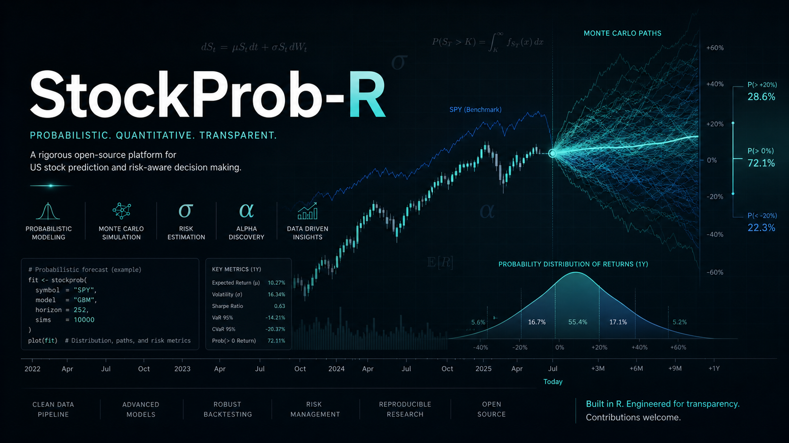

<p align="center">
  
</p>

# StockProb-R

StockProb-R is a serious quantitative US stock prediction and ranking system. It predicts whether a stock is likely to outperform SPY over a selected future horizon, with modular JavaScript and R implementations kept in separate folders.

> This is math, not advice. Outputs are probabilistic and must be validated with backtesting before use.

## Live Demo

Vercel deployment: [https://stockprob-r.vercel.app](https://stockprob-r.vercel.app)

## Repository Layout

```text
stockprob-r/
  assets/
    banner.png
  js/
    api/
      outperform.js
      universe.js
    server/
      data/
      features/
      models/
      realtime/
      backtesting/
    src/
    tests/
  r/
    stockprob_engine.R
    stockprob_cli.R
    tests/
  docs/
```

## What It Calculates

- Probability of outperforming SPY
- Expected return
- Expected excess return versus SPY
- Risk score and risk label
- Confidence score
- Technical score
- Fundamental quality score
- News sentiment score
- Macro and sector score
- Composite alpha score
- Final signal: `bullish`, `watchlist`, `neutral`, `bearish`, or `avoid`
- Main drivers and feature importance
- Walk-forward backtest metrics
- Provider health and graceful degradation warnings

## JavaScript App

```bash
cd js
npm install
npm test
npm run build
npm run dev
```

Local app:

```text
http://localhost:8080
```

API:

```bash
curl "http://localhost:8080/api/outperform?ticker=MSFT&horizon=5"
curl "http://localhost:8080/api/price?ticker=MSFT&limit=520"
curl "http://localhost:8080/api/universe?q=micro&limit=10"
curl "http://localhost:8080/api/model/report?horizon=5"
curl "http://localhost:8080/api/health"
```

Realtime WebSocket server for local or dedicated Node deployments:

```bash
cd js
npm run realtime
```

Then point the dashboard at it:

```bash
VITE_REALTIME_URL=ws://localhost:8091 npm run dev
```

Supported realtime messages are `analyze`, `rank`, `universe.search`, `watchlist.subscribe`, `watchlist.unsubscribe`, `backtest`, `agent.blank`, `cancel`, `ping`, and `metrics`. The realtime server includes payload limits, heartbeat cleanup, per-client rate limiting, request lifecycle tracking, cancellation, bounded-concurrent ranking, streaming leaderboard updates, watchlist snapshots/updates, backtest progress events, provider status events, and server metrics. Vercel serverless deployment keeps using HTTP fallback because Vercel functions are not long-lived WebSocket servers.

Background worker for queued rank/backtest/provider jobs:

```bash
cd js
npm run worker -- --status
npm run worker -- --once
```

Local mode drains the in-process memory queue. Set `REDIS_URL` and run `npm run worker` as a separate long-lived process when deploying distributed workers.

Nightly cron orchestration:

```bash
curl -X POST "http://localhost:8080/api/cron/nightly" \
  -H "Authorization: Bearer $CRON_SECRET" \
  -H "Content-Type: application/json" \
  -d '{"tickers":["MSFT","AAPL","NVDA"],"horizon":5}'
```

Vercel is configured to call `/api/cron/nightly` at `07:00 UTC` on market weekdays. The endpoint enqueues provider-refresh, ranking, and backtest jobs; set `CRON_SECRET` in production.

## Robustness Model

The app is designed to fail closed and explain data gaps instead of silently inventing numbers.

- Provider calls are isolated with retries, timeouts, and in-memory caching.
- Identical concurrent provider requests are coalesced and the process cache is bounded to prevent unbounded growth.
- If a paid data provider is unavailable, the response includes a provider warning and uses the next configured fallback where possible.
- If core price history for the ticker or SPY is insufficient, the API returns a structured `503` rather than a misleading prediction.
- The UI has an error boundary and a live API/provider health indicator.
- Serverless responses set cache headers for repeated public-data requests.
- The listed-symbol universe is loaded from NASDAQ Trader symbol directories for NASDAQ, NYSE, NYSE American, NYSE Arca, Cboe BZX, and related listed US securities.
- WebSocket analysis streams typed progress/result events in Node environments, while HTTP remains the safe deployment fallback.
- Realtime requests are keyed by `request_id`, can be cancelled, and expose lightweight server metrics for active work.
- Rank, backtest, analysis, and provider-refresh jobs share a queue contract with local memory fallback and Redis-ready worker status.
- `/api/cron/nightly` pre-warms provider status, rankings, and backtest work through the queue; production requests should use `CRON_SECRET`.
- `/api/model/report` returns Brier score, calibration bins, and threshold metrics from supplied realized outcomes. Demo mode is visibly marked and must not be treated as production accuracy evidence.
- A blank realtime agent channel is available as `agent.blank`; it stores short operational conversation turns and intentionally does not generate trading advice.

No market system can guarantee zero failures or perfect accuracy. StockProb-R reduces operational failure modes and makes uncertainty visible.

## R Engine

```bash
cd r
Rscript tests/test_stockprob_engine.R
Rscript stockprob_cli.R --ticker MSFT --window-days 30 --as-of-date 2026-05-16 --risk-tolerance moderate --seed 42
```

## Data Providers

Bloomberg is supported only through official Bloomberg API / BLPAPI-style configuration. The project does not scrape Bloomberg webpages.

Fallback providers:

- Polygon.io for adjusted OHLCV
- yfinance-compatible Yahoo Finance chart endpoint for development fallback
- NASDAQ Trader listed-symbol directories for searchable US security coverage
- Alpha Vantage for public news sentiment
- Financial Modeling Prep for fundamentals
- FRED for macro rates, inflation, labor, and yield-curve context

Environment variables:

```bash
BLOOMBERG_API_ENABLED=false
BLOOMBERG_HOST=localhost
BLOOMBERG_PORT=8194
POLYGON_API_KEY=
ALPHA_VANTAGE_API_KEY=
FMP_API_KEY=
FRED_API_KEY=
```

If Bloomberg or paid providers are not configured, the app remains usable with fallback sources and returns explicit provider warnings.

## Advanced Charts and Analytics

The advanced charting route is available at:

```text
https://stockprob-r.vercel.app/analytics?ticker=MSFT
```

Local route:

```text
http://localhost:8080/analytics?ticker=MSFT
```

Chart stack:

- Recharts: dashboard cards, probability trends, expected return, SPY comparison, risk/confidence, equity and drawdown basics.
- TradingView Lightweight Charts: candlestick/OHLC and volume price analysis.
- Plotly.js: Monte Carlo fan chart, terminal-return histogram, percentile bands, VaR and CVaR views.
- Apache ECharts: feature importance, heatmaps, ranking scatter plots, calibration curves, macro regime, provider health views.

The Analytics page shows:

- Price analysis: OHLC candlesticks, volume, stock cumulative return versus SPY, and excess return.
- Prediction analysis: probability trend, expected return, expected excess return, risk, and confidence.
- Monte Carlo simulation: GBM percentile bands, sampled paths, final-return distribution, probability of profit, VaR 5%, expected shortfall, median final price, and estimated drawdown.
- Feature analysis: model feature importance, technical score components, fundamental score components, news sentiment timeline, and macro regime chart.
- Market ranking: sector heatmap and expected-return/probability scatter view.
- Backtest: strategy equity curve versus SPY, drawdown, calibration curve, and confidence-bucket hit-rate chart.
- Provider health: API/provider status, fallback counts, warnings, and refresh state.

Fallback behavior:

- Chart data loaders try existing backend endpoints first, including `/api/outperform`, `/api/price`, `/api/rank`, `/api/backtest`, `/api/model/report`, and `/api/health`.
- If a chart endpoint fails or returns incomplete data, the page renders deterministic demo data seeded by ticker symbol.
- Demo/fallback sections are visibly labeled in the UI.
- Demo chart data is stable across renders so screenshots, tests, and UI review do not shift randomly.

Data policy:

- The app does not scrape hidden/private/paid pages.
- Bloomberg webpages and broker dashboards are never scraped.
- Production data should use official APIs, public datasets, or app-generated derived features only.

## Live Data, yfinance Fallback, and Provider Architecture

StockProb-R now has a cache-first live layer designed for Vercel serverless and Node/self-hosted deployments.

REST endpoint groups:

- Universe: `/api/universe?q=MSFT`, existing symbol coverage search.
- Market: `/api/market/quote/MSFT`, `/api/market/ohlcv/MSFT?interval=1d`, `/api/market/benchmarks`, `/api/market/technicals/MSFT`.
- Probabilities: `/api/probabilities/MSFT?horizonDays=5`.
- Charts: `/api/charts/price/MSFT?benchmark=SPY`.
- System: `/api/system/health`, `/api/system/providers`, `/api/system/queues`, `/api/system/staleness`.
- Streaming fallback: `/api/stream/quotes?symbols=MSFT,AAPL`, `/api/stream/probabilities?symbols=MSFT,AAPL`, `/api/stream/system`, `/api/stream/provider-health`.

New REST endpoints use a consistent envelope:

```json
{
  "ok": true,
  "data": {},
  "meta": {
    "source": "cache|provider|db|demo|yfinance|polygon|fmp|fred|sec",
    "isDemo": false,
    "asOf": "2026-05-16T10:30:00.000Z",
    "stale": false,
    "latencyMs": 123,
    "warnings": []
  }
}
```

Realtime behavior:

- Browser client first tries `VITE_REALTIME_URL` WebSocket endpoints for Node/self-hosted deployments.
- If WebSocket is unavailable, it uses Vercel-safe Server-Sent Events.
- If SSE fails, it falls back to intelligent polling.
- Polling backs off when the tab is hidden and after errors.
- Quote updates use 5-15 second cadence; probability/provider/system updates use slower refresh intervals.

Provider priority:

- Quotes/OHLCV/benchmarks: Polygon/Massive when `POLYGON_API_KEY` exists, then yfinance-compatible Yahoo chart endpoint, then cache/demo.
- Fundamentals: Financial Modeling Prep when `FMP_API_KEY` exists, then cache/demo.
- News: Alpha Vantage when `ALPHA_VANTAGE_API_KEY` exists, then cache/demo.
- Macro: FRED when `FRED_API_KEY` exists, then cache/demo.
- Filings/insiders: SEC EDGAR with `SEC_USER_AGENT`, then cache/demo.
- Options: Polygon/Tradier when configured; Yahoo/yfinance options are treated as development-only and currently fail closed to cache/demo.

yfinance/Yahoo disclaimer:

- Yahoo/yfinance fallback is unofficial and intended for development/prototyping only.
- It uses public chart/quote-style endpoints only.
- It does not scrape Yahoo webpages and does not parse HTML.
- It should not be treated as production-grade market data or final accuracy infrastructure.

Environment variables:

```bash
POLYGON_API_KEY=
FMP_API_KEY=
ALPHA_VANTAGE_API_KEY=
FRED_API_KEY=
SEC_USER_AGENT=
TRADIER_API_KEY=
REDIS_URL=
DATABASE_URL=
CRON_SECRET=
USE_YFINANCE=true
ENABLE_DEMO_FALLBACK=true
```

Cache and jobs:

- `src/lib/cache.js` provides TTL cache, stale-while-revalidate behavior, request coalescing, memory fallback, and Redis-ready status reporting.
- `src/lib/jobs.js` records queue intent safely without crashing when Redis is missing.
- `db/schema.sql` documents the production Postgres/Neon tables for universe, price bars, fundamentals, earnings, news, filings, insiders, options, macro snapshots, derived features, predictions, backtests, provider health, and jobs.

Suggested TTLs:

- Quotes: 5-15 seconds during market hours, 60 seconds after hours.
- Daily OHLCV: 1-6 hours.
- Intraday OHLCV: 30-120 seconds.
- Fundamentals and earnings: 6-24 hours.
- News: 15-60 minutes.
- FRED macro: 12-24 hours.
- SEC filings: 1-6 hours.
- Probabilities: 30-120 seconds.
- Provider health: 30-120 seconds.

Demo fallback:

- Missing provider keys do not crash local development or production.
- Demo data is deterministic and visibly labeled in live UI components.
- Demo fallback is a reliability feature, not an accuracy claim.

No hidden/private scraping policy:

- Do not scrape Bloomberg webpages, broker dashboards, TradingView pages, paywalled data, or protected UIs.
- Use official APIs, licensed providers, public datasets, SEC EDGAR, FRED, FMP, Alpha Vantage, Polygon/Massive, and app-generated derived features only.

Local run:

```bash
cd js
npm install
npm run dev
```

Vercel deployment:

```bash
cd js
vercel --prod
```

Known limitations:

- Vercel serverless does not provide long-lived WebSocket hosting; SSE/polling is the production fallback.
- Redis and Postgres adapters are readiness/stubbed unless `REDIS_URL` and `DATABASE_URL` are configured.
- Polygon/Tradier options integration is not enabled unless corresponding credentials and provider work are added.

## Connected Dashboard Architecture

StockProb-R now has a connected dashboard route at `/dashboard?ticker=MSFT`. It is built around one normalized snapshot instead of isolated widgets.

Data flow:

- `GET /api/dashboard/:symbol/snapshot` returns quote, candles, benchmark comparison, probabilities, Monte Carlo, features, macro, rankings, backtest, provider health, system health, and memory health in the standard REST envelope.
- `GET /api/stream/dashboard?symbols=MSFT` sends lightweight realtime patches for quote, probability, provider, system, and memory state. It does not stream full candles or all simulation paths.
- `useDashboardLiveData()` fetches the initial snapshot, subscribes to realtime updates, merges patches into the snapshot, and falls back through WebSocket/SSE/polling using `src/lib/liveClient.js`.
- Chart components consume the same normalized dashboard model used by summary cards and health panels.

Dashboard sections:

- Live header and summary cards for price, probability, expected return, excess return, risk, confidence, source, and freshness.
- Price and benchmark charts using TradingView Lightweight Charts and Recharts.
- Probability, expected return, risk, confidence, and feature charts.
- Monte Carlo fan, histogram, and risk cards using Plotly with backend path downsampling.
- News/sentiment, macro regime, sector heatmap, ranking scatter, backtest equity, drawdown, provider health, system coverage, and memory health.

Math/model modules:

- `src/lib/math/returns.js`
- `src/lib/math/technicals.js`
- `src/lib/math/risk.js`
- `src/lib/math/probabilities.js`
- `src/lib/math/monteCarlo.js`
- `src/lib/math/backtest.js`
- `src/lib/math/calibration.js`
- `src/lib/math/featureScoring.js`
- `src/lib/math/macroRegime.js`

Cache and memory management:

- `src/lib/cache.js` supports TTL, stale-while-revalidate, request coalescing, cache stats, and bounded memory fallback.
- `src/lib/requestDeduper.js` deduplicates identical in-flight dashboard/API calls and aborts superseded work.
- `src/lib/memoryManager.js` tracks cache entry count, approximate cache bytes, active subscriptions, polling loops, in-flight requests, cleanup time, and warnings.
- `GET /api/system/memory` and `GET /api/stream/memory` expose memory status to the dashboard.

Queue and jobs:

- `src/lib/jobs.js` records queue intent for refresh, feature generation, probability refresh, Monte Carlo, backtest, and provider health jobs.
- Without Redis it runs as a safe memory stub. With `REDIS_URL`, the status reports Redis-ready mode for a production queue adapter.

Provider and fallback order:

- Quotes/OHLCV/benchmarks: Polygon/Massive, then Yahoo/yfinance development fallback, then cache/demo.
- Fundamentals: FMP, then cache/demo.
- News: Alpha Vantage, then cache/demo.
- Macro: FRED, then cache/demo.
- Filings/insiders: SEC EDGAR, then cache/demo.
- Probabilities: feature/model snapshot, then cache/demo.

Yahoo/yfinance policy:

- Yahoo/yfinance is unofficial and intended for development/prototyping only.
- The app labels it clearly in API metadata and dashboard badges.
- It uses public chart/quote endpoints only. It does not scrape Yahoo webpages or parse HTML.

Demo mode:

- Missing API keys do not break builds or the dashboard.
- `src/lib/demoDashboardData.js` and `src/lib/demoChartData.js` generate deterministic realistic data by symbol.
- Demo/fallback data is visibly labeled; it is not an accuracy claim.

New connected endpoints:

- `GET /api/dashboard/:symbol`
- `GET /api/dashboard/:symbol/snapshot`
- `GET /api/dashboard/:symbol/charts`
- `POST /api/dashboard/:symbol/refresh`
- `GET /api/dashboard/system`
- `GET /api/system/memory`
- `GET /api/stream/dashboard`
- `GET /api/stream/memory`
- `GET /api/monte-carlo/:symbol`
- `GET /api/charts/system/coverage`

## Backend UI Investment Dashboard

Branch `backend-ui` adds a polished dark investment-platform interface on top of the connected API layer. It keeps the same math/model/provider architecture, but presents it as a compact research terminal with consistent red/green/amber status semantics.

Pages:

- `/dashboard?ticker=MSFT` - live connected ticker dashboard with quote, probability, risk, confidence, price/benchmark charts, Monte Carlo, feature engines, provider health, related opportunities, rankings preview, and backtest preview.
- `/rankings?base=MSFT` - screener/ranking workspace with search, sector filter, sort controls, similar-stock cards, scatter plot, heatmap, and dense comparable table.
- `/backtest?ticker=MSFT` - validation terminal with controls, strategy-vs-SPY metrics, equity curve, drawdown, calibration, confidence buckets, and recent signal log.
- `/data-health` - provider/system/cache/memory page with source statuses, coverage, queue state, cache status, staleness, and runtime tables.
- `/analytics?ticker=MSFT` - advanced chart page retained for deeper chart exploration.

UI architecture:

- `src/styles/theme.css` defines the investment theme tokens: dark background, graphite panels, ignite red, market green, amber warnings, and compact table/card primitives.
- `src/components/ui/*` provides reusable `AppShell`, `PageHeader`, `MetricCard`, `ChartCard`, `StatusBadge`, `SourceBadge`, `FreshnessBadge`, `SegmentedControl`, `ControlPanel`, `LoadingSkeleton`, `EmptyState`, and `CompactTable` components.
- `src/components/dashboard/*` now includes a command center, analysis control panel, metric strip, feature engine, external data panel, similar-stock suggestions, ranking preview, backtest preview, and data-health preview.
- `src/lib/rankingApi.js`, `src/lib/backtestApi.js`, and `src/lib/dataHealthApi.js` call real REST endpoints first and fall back to deterministic demo data when endpoints or provider keys are unavailable.
- `src/lib/suggestionsApi.js`, `src/lib/demoSuggestionsData.js`, and `src/lib/similarityEngine.js` provide peer and alternative-stock suggestions with sector, volatility, risk/return, momentum, quality, and confidence similarity scoring.
- Normalizers in `src/lib/normalizeRankingData.js`, `src/lib/normalizeBacktestData.js`, and `src/lib/normalizeHealthData.js` accept messy backend shapes and return safe UI-ready records.
- `src/lib/math/scenarios.js` and `src/lib/math/benchmarking.js` support scenario-adjusted expected return/volatility and benchmark comparison utilities.

Configurable dashboard controls:

- Horizon: `5D`, `10D`, `30D`, `60D`, `90D`, `180D`, `1Y`
- Benchmark: `SPY`, `QQQ`, `DIA`, `IWM`, `XLK`
- Scenario: base, bull, bear, high volatility, recession risk, earnings week
- Return mode: absolute, excess, risk-adjusted
- Probability target: profit, outperform, gain threshold, loss threshold
- Custom gain/loss thresholds
- Historical/implied/custom volatility assumption
- Model/analyst/historical/custom expected return assumption
- Compact/standard/detailed chart density

Runtime behavior:

- The dashboard uses REST for the initial snapshot and the existing WebSocket/SSE/polling client for live quote, probability, provider, system, and memory updates.
- Missing provider keys show `not_configured`, `fallback`, or `demo` instead of breaking the UI.
- Yahoo/yfinance remains labeled as an unofficial development/prototype fallback.
- No hidden/private/paywalled scraping is used.

Local run:

```bash
cd js
npm install
npm run dev -- --host 127.0.0.1 --port 8080
```

Validation:

```bash
cd js
npm run check
npm test
npm run build
```

Database planning:

- `js/db/schema.sql` includes production tables for universe, prices, fundamentals, earnings, news, filings, insiders, options, macro snapshots, derived features, predictions, Monte Carlo runs, backtest runs, provider health, job runs, and system snapshots.

No hidden/private scraping:

- Do not scrape Bloomberg webpages, broker dashboards, TradingView pages, paywalled data, or protected UIs.
- Use official APIs, licensed providers, public datasets, SEC EDGAR, FRED, FMP, Alpha Vantage, Polygon/Massive, and app-generated derived features only.

## Backtesting

The JavaScript engine includes a walk-forward backtest module that:

- Uses time-ordered feature windows
- Prevents lookahead bias by slicing features before exits
- Supports 5, 10, and 20 trading day horizons
- Compares selected stocks against SPY
- Includes transaction cost and slippage assumptions

## Accuracy and Calibration

Accuracy is not claimed by default. It must be measured per universe, horizon, rebalance schedule, and provider set.

Recommended validation before relying on a model:

1. Run walk-forward backtests over multiple market regimes.
2. Compare hit rate against SPY by confidence bucket.
3. Track calibration: predictions near 60% should win near 60% over a large sample.
4. Review performance by sector and volatility regime.
5. Refit or retune weights only with time-split training data.

The repository currently ships a transparent heuristic/logistic baseline. It is intentionally explainable and can be replaced later by trained logistic regression, random forest, XGBoost, LightGBM, or ensemble models after validated training data exists.

## Deployment

The Vercel app is deployed from the `js/` directory.

```bash
cd js
vercel --prod
```

## Docker and Google Cloud Run

StockProb-R can also run as a Docker container on Google Cloud Run. The container builds the Vite frontend, serves `js/dist`, and runs the existing API handlers from a long-running Node HTTP server.

Local Docker build:

```bash
docker build -t stockprob-r:local .
docker run --rm -p 8080:8080 \
  -e USE_YFINANCE=true \
  -e ENABLE_DEMO_FALLBACK=true \
  stockprob-r:local
```

Local production server without Docker:

```bash
cd js
npm ci
npm run build
PORT=8080 npm start
```

Cloud Run runtime:

- Entrypoint: `npm start`
- Port: `8080`
- Health endpoint: `/api/health`
- Main app: `/dashboard?ticker=MSFT`
- Data health: `/data-health`
- Realtime fallback: Server-Sent Events under `/api/stream/*`

GitHub Actions deployment:

- Workflow: `.github/workflows/gcp-cloud-run.yml`
- Builds the root `Dockerfile`
- Pushes to Google Artifact Registry
- Deploys to Cloud Run
- Can be run manually with `workflow_dispatch`
- Also runs on pushes to `main` when Docker/app files change

Required GitHub repository variables:

```text
GCP_PROJECT_ID
GCP_WORKLOAD_IDENTITY_PROVIDER
GCP_SERVICE_ACCOUNT
```

Optional GitHub repository variables:

```text
GCP_ARTIFACT_REGION=us-central1
GCP_ARTIFACT_REPOSITORY=stockprob-r
CLOUD_RUN_SERVICE=stockprob-r
CLOUD_RUN_REGION=us-central1
```

Recommended Cloud Run environment variables:

```text
POLYGON_API_KEY
FMP_API_KEY
ALPHA_VANTAGE_API_KEY
FRED_API_KEY
SEC_USER_AGENT
TRADIER_API_KEY
REDIS_URL
DATABASE_URL
CRON_SECRET
USE_YFINANCE=true
ENABLE_DEMO_FALLBACK=true
```

Do not bake `.env.local` or provider secrets into the image. The Docker ignore file excludes local env files; configure secrets through Cloud Run environment variables or Secret Manager.

## License

MIT
